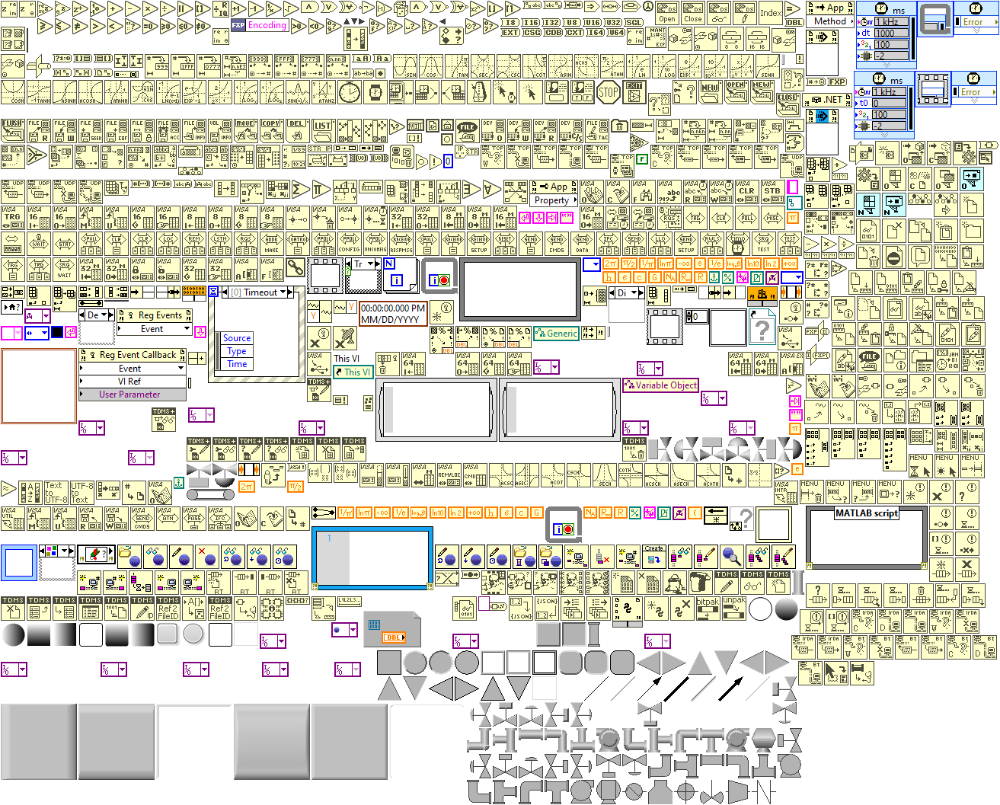

# LabVIEW-Export-Built-ins
Exports all built-in LabVIEW Functions and Controls to VI Snippet images

## Getting Started

Run the `Source\Export-Built-ins.vi` to export all built-in LabVIEW Functions and Controls.

All functions and controls are exported to `LabVIEW YYYY\Functions` & `LabVIEW YYYY\Controls` directories,
where `YYYY` is the LabVIEW version year.

**Each PNG image is a VI Snippet, which can be drag-and-dropped to the block diagram to load.**

## LabVIEW Versions

[LabVIEW 2018](LabVIEW 2018)

[LabVIEW 2022](LabVIEW 2022)

## Overview

LabVIEW's built-in Functions and Controls that are not easily identified by the function and
control palettes. This library exports all built-in functions and controls as VI Snippets (png) images,
identified my the object id & name which can then be loaded by drag-and-drop on the block diagram.

For each built-in image, there is also a metadata text file that contains object information
such as name(s), class identifiers, and connector pane terminals (input/output, including bounds, 
color, and name).

## Support

Submit a ticket for bug fixes or feature requests.

-Ryan Pacini